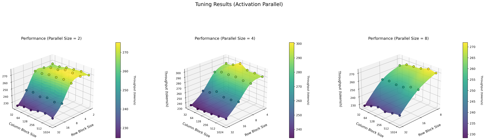
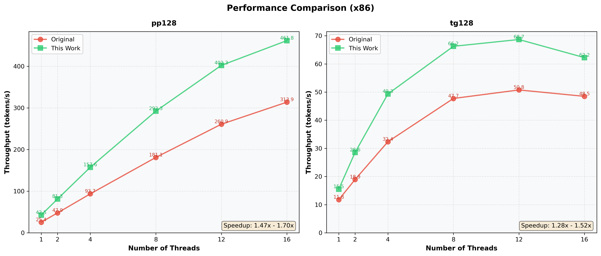
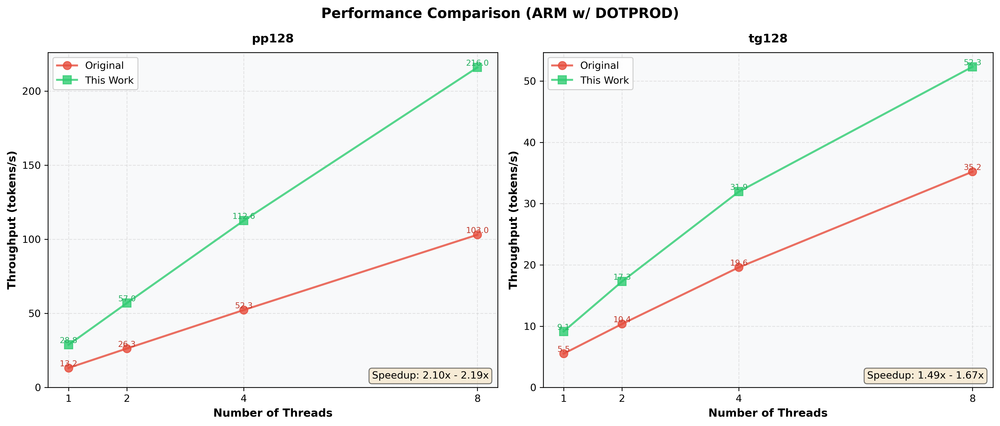

# BitNet CPU Inference Optimization

This update provides significant performance improvements for BitNet inference on CPU through paralleled kernel implementations, native I2_S GEMM/GEMV support, configurable tiling block size and embedding quantization.

## Update

- **Parallel Weight & Activation Computation**  
  Implemented parallel processing of weights and activations in the W2A8 vet_dot kernel, achieving improved throughput on both x86 and ARM architectures.

- **Native I2_S GEMM & GEMV Support**  
  Integrated I2_S GEMM and GEMV operations into ggml library, making them fully compatible with the llama.cpp architecture. This enables seamless integration with existing inference pipelines.

- **Configurable Tiling & Parallelism**  
  Introduced configurable GEMM & GEMV block sizes and parallelism levels, allowing performance fine-tuning for different CPU architectures.

- **Embedding Quantization**  
  Added support for embedding layer quantization with Q6_K format, reducing memory footprint and improving inference speed while maintaining high accuracy.

## Usage

### Configuration Options

The `include/gemm-config.h` file controls kernel behavior:

```c
#define ROW_BLOCK_SIZE 4
#define COL_BLOCK_SIZE 128
#define PARALLEL_SIZE 4
```

Modify these values based on your CPU cache size and architecture for optimal performance. Users can fine-tune performance on their machine through `include/gemm-config.h`.

### Enabling Embedding Quantization

To use embedding quantization for additional speedup:

**Using setup_env.py:**
```bash
python setup_env.py --quant-embd
```
This automatically converts embeddings to Q6_K format.

**Manual conversion:**
```bash
build/bin/llama-quantize --token-embedding-type Q6_K models/BitNet-b1.58-2B-4T/ggml-model-f32.gguf models/BitNet-b1.58-2B-4T/ggml-model-i2_s-embed-q6_k.gguf I2_S 1 1
```

## Optimizations

### 1. Weight & Activation Parallelism

The kernel implements two parallelization strategies:

- **Weight Parallel:** Processes multiple weight rows/columns in a single kernel call, reducing kernel launch overhead.

- **Activation Parallel:** Built on top of weight parallel, amortizes the I2_S weight unpacking cost across multiple activation elements.

**Recommendation:** For I2_S quantization format, activation parallel is recommended due to the unpack operation benefits. The current kernel defaults to activation parallel.

**Kernel Performance Comparison:**

<div align="center">

Test configuration: AMD EPYC 7V13 (x86), 1 threads, time in milliseconds (mean±std)

| Matrix Size | No Parallel | Weight Parallel | Activation Parallel |
|:---:|:---:|:---:|:---:|
| [1, 2048] × [2048, 2048] | 0.075±0.012 | **0.058±0.007** | 0.076±0.011 |
| [32, 2048] × [2048, 2048] | 2.400±0.041 | 1.599±0.020 | **1.202±0.018** |
| [128, 2048] × [2048, 2048] | 10.820±0.039 | 6.458±0.168 | **5.805±0.039** |
| [256, 2048] × [2048, 2048] | 21.669±0.080 | 12.739±0.183 | **11.882±0.040** |
| [512, 2048] × [2048, 2048] | 43.257±0.083 | 25.680±0.335 | **23.342±0.082** |
| [2048, 2048] × [2048, 2048] | 173.175±0.214 | 103.112±0.552 | **93.276±0.612** |
| [128, 2048] × [2048, 8192] | 43.345±0.090 | 25.541±0.239 | **23.528±0.052** |
| [128, 8192] × [8192, 2048] | 38.085±0.162 | 23.866±0.096 | **22.569±0.132** |

</div>

### 2. GEMM/GEMV Integration with llama.cpp

Integrated I2_S quantization format into llama.cpp's compute graph:

- **GEMV Operations:** Optimized matrix-vector multiplication for token generation.
- **GEMM Operations:** Efficient matrix-matrix multiplication for prompt processing.
- **Tiling Strategy:** Configurable block sizes for optimal cache utilization.

### 3. Configuration Fine-tuning

Fine-tuning kernel parameters for optimal performance on specific hardware:

**Example Configuration (x86, AMD EPYC 7V13):**
- Method: Activation Parallel
- Threads: 8
- Workload: 128 prompt tokens (pp128)

**Fine-tuning Parameters:**
- **Parallelism Degree:** [2, 4, 8]
- **Row Block Size:** [2, 4, 8, 16, 32]
- **Column Block Size:** [32, 64, 128, 256, 512, 1024]

**Fine-tuning Results:**

<div align="center">



*Shows throughput (tokens/s) for various configurations.*

</div>

**Optimal Configuration:** Under this setup (x86, 8 threads, pp128), the best performance is achieved with parallelism degree = 4, row block size = 4, and column block size = 128.

### 4. Embedding Quantization

Evaluated multiple embedding quantization formats to balance memory usage, model quality, and inference speed:

**Perplexity Comparison:**

<div align="center">

Test configuration: BitNet-b1.58-2B-4T, TG128

| Embedding Type | Wikitext | PTB | LAMBADA | IMDB | AG NEWS |
|:---:|:---:|:---:|:---:|:---:|:---:|
| **F32** | 17.1090±0.1278 | 33.0858±0.4886 | 43.2850±0.6363 | 29.3016±0.2890 | 36.7686±0.3920 |
| **F16** | 17.1090±0.1278 | 33.0858±0.4886 | 43.2850±0.6363 | 29.3016±0.2890 | 36.7686±0.3920 |
| **Q8_0** | 17.1197±0.1280 | 33.1181±0.4893 | 43.2891±0.6364 | 29.3133±0.2892 | 36.7740±0.3920 |
| **Q6_K** | 17.1487±0.1282 | 33.2203±0.4914 | 43.3046±0.6362 | 29.3491±0.2897 | 36.7972±0.3921 |
| **Q5_0** | 17.2379±0.1288 | 33.2439±0.4907 | 43.4631±0.6379 | 29.5481±0.2920 | 36.8539±0.3924 |
| **Q4_0** | 17.3529±0.1300 | 33.7754±0.5001 | 44.4552±0.6559 | 30.1044±0.2978 | 37.3985±0.3997 |
| **Q3_K** | 17.6434±0.1320 | 34.3914±0.5089 | 45.4591±0.6735 | 30.8476±0.3069 | 39.5692±0.4259 |
| **I2_S** | N/A | N/A | N/A | N/A | N/A |

**N/A indicates model failure due to extreme quantization.*

</div>

**Inference Speed Comparison:**

<div align="center">


*Token generation throughput (tg128) for different embedding quantization types.*

</div>

**Recommendation:** Based on comprehensive evaluation of memory footprint, perplexity preservation, and inference speed, **Q6_K** is selected as the optimal embedding quantization format.

## Performance

Comparison of optimized parallel kernels vs. original implementation:

**Test Configuration:**
- Model: BitNet-b1.58-2B-4T
- Hardware: AMD EPYC 7V13 64-Core Processor
- Threads: 1 / 2 / 4 / 8 / 12 / 16
- Test: 128 prompt tokens (pp128) + 128 generated tokens (tg128)
- Method: Activation Parallel

<div align="center">



</div>

**Test Configuration:**
- Model: BitNet-b1.58-2B-4T
- Hardware: ARM Core
- Threads: 1 / 2 / 4 / 8
- Test: 128 prompt tokens (pp128) + 128 generated tokens (tg128)
- Method: Activation Parallel with DOTPROD

<div align="center">



</div>

**Test Configuration:**
- Model: BitNet-b1.58-2B-4T
- Hardware: ARM Core
- Threads: 1 / 2 / 4 / 8
- Test: 128 prompt tokens (pp128) + 128 generated tokens (tg128)
- Method: Activation Parallel without DOTPROD

<div align="center">


</div>

## Technical Details

### Key Files Modified

- `src/ggml-bitnet-mad.cpp`: Parallel kernel implementations
- `3rdparty/llama.cpp/ggml/src/ggml.c`: GEMM/GEMV integration
- `include/gemm-config.h`: Configuration file

### Supported Architectures

- ✅ x86-64 with AVX2
- ✅ ARM with NEON
- ✅ ARM with DOTPROD extension
